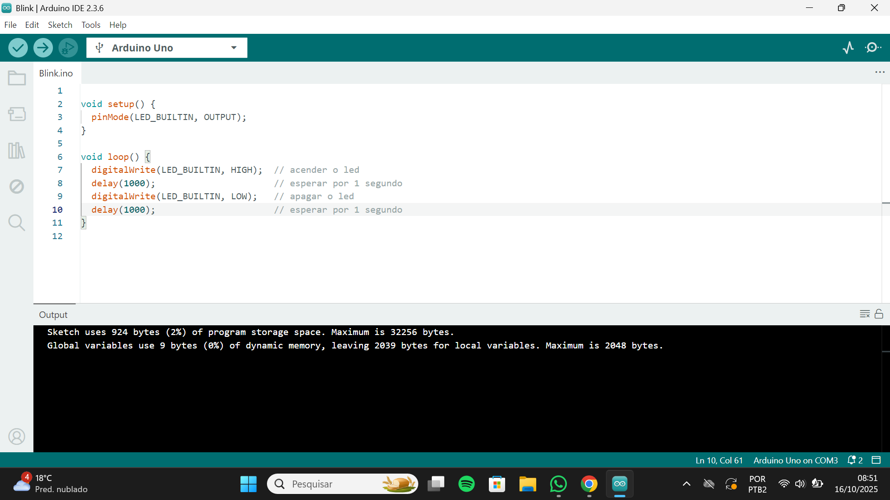
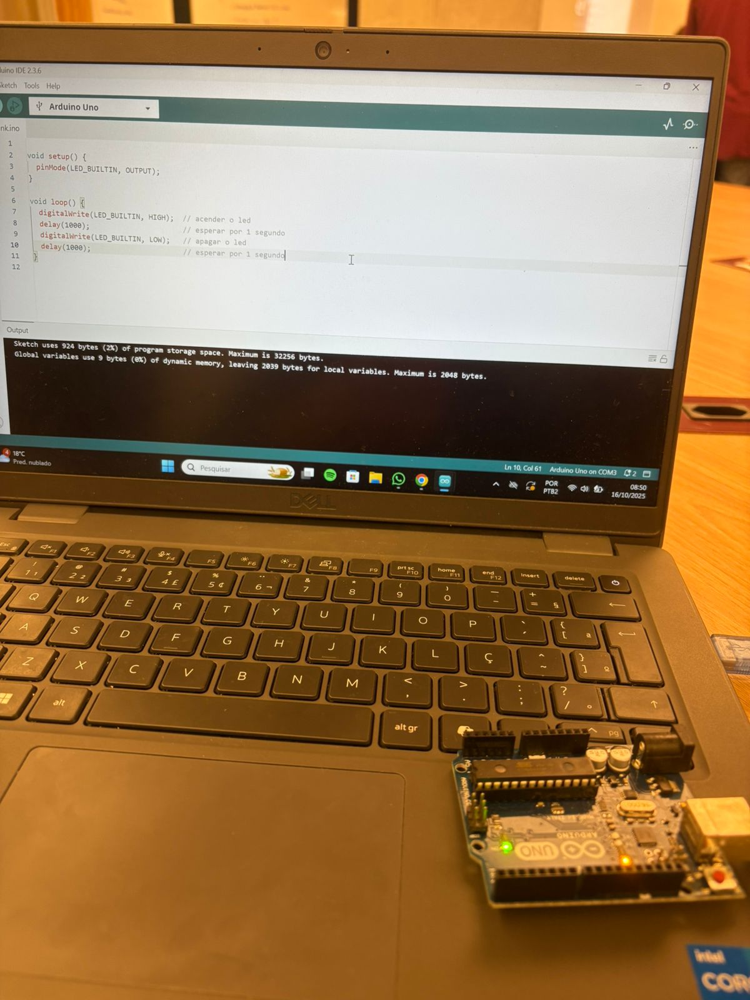
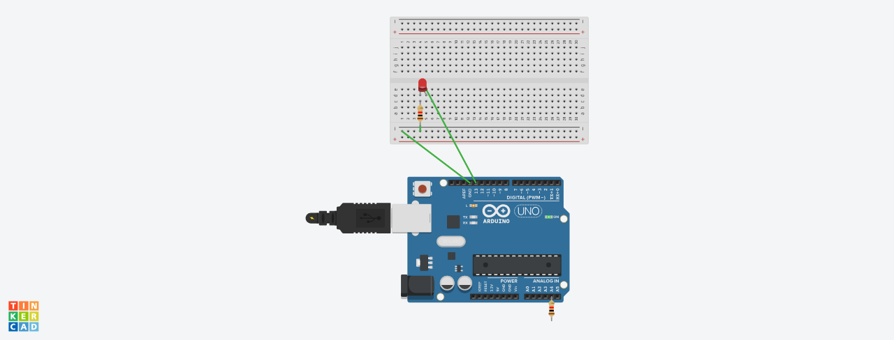

# Ponderada-Semana1-M4-Arduino

## Parte 1: Blink Led Interno

Código:


Realização:


## Parte 2: Parte 2: Simulando Blink Externo

Circuito simulado no TinkerCad:


Código:

``` 
int led = 13;

void setup()
{
  pinMode(led, OUTPUT);
}

void loop()
{
  digitalWrite(led, HIGH);
  delay(1000); // Wait for 1000 millisecond(s)
  digitalWrite(led, LOW);
  delay(1000); // Wait for 1000 millisecond(s)
}
``` 
